## **Documentation for Project 12**

### Refactoring our Ansible for better maintainablity and extensibility

### Creating a new directory for jenkins to save artifacts to reduce complexity && Permission changed for jenkins to save artifacts in the new directory

`sudo mkdir /home/ubuntu/ansible-config-artifact`

`chmod -R 0777 /home/ubuntu/ansible-config-artifact`

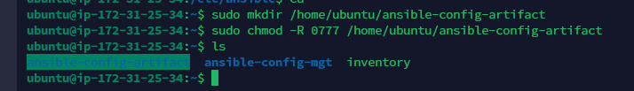

### Copy Artifact plugin Installed on Jenkins

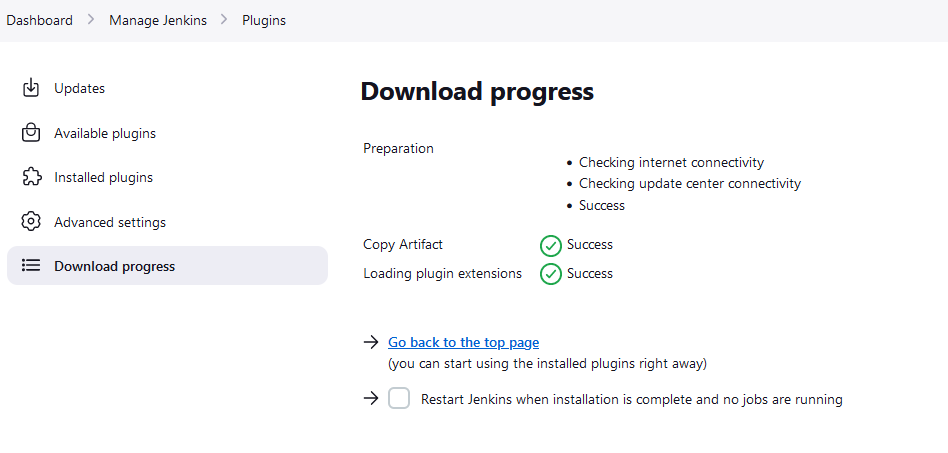

### save_artifact freestyle project created on Jenkins

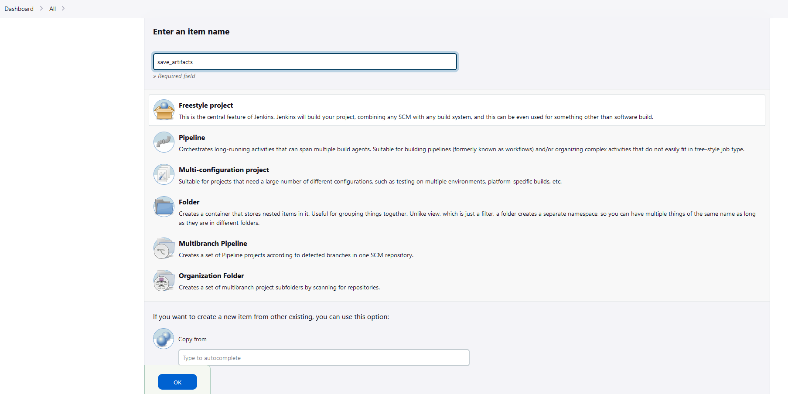

### Configuring Number of Builds to Keep and which Project to Build Artifacts from

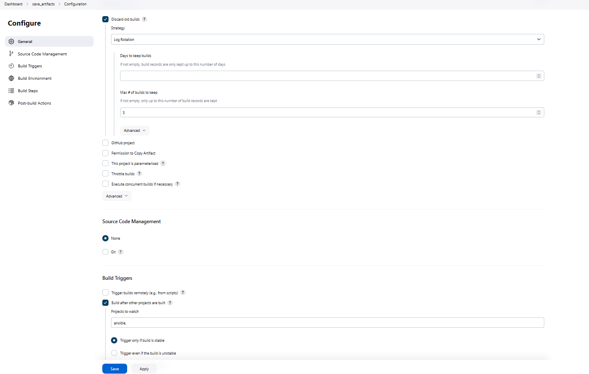

### Configuring a Build Step to copy artifact from project11ansible and Specifying the target directory which is ansible-config-artifact

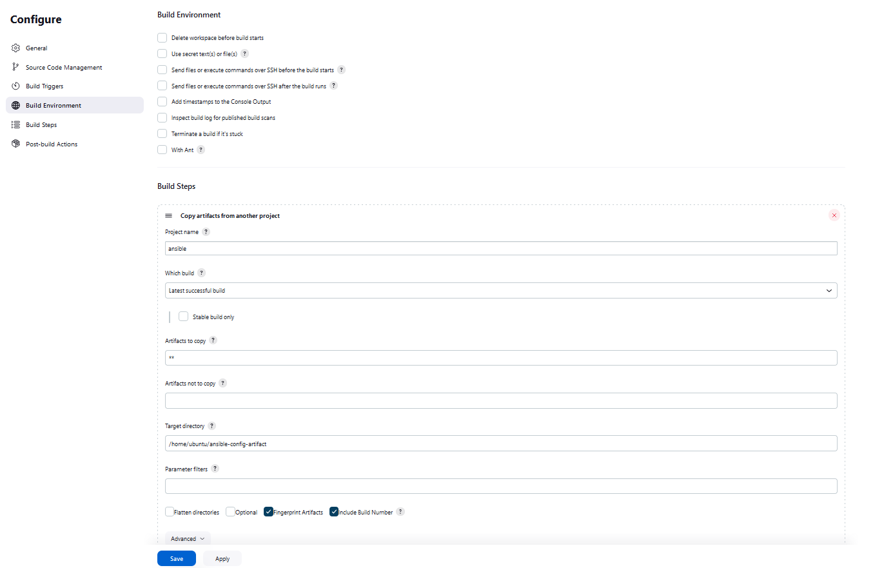

### Successfully-configured
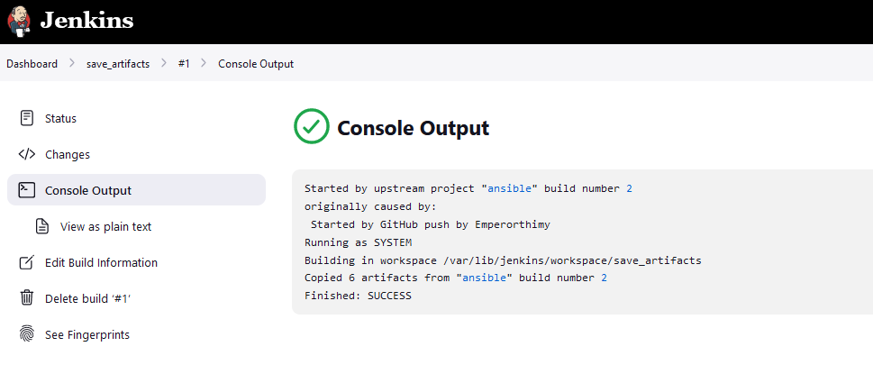

### Testing our setup by making changes to readme file
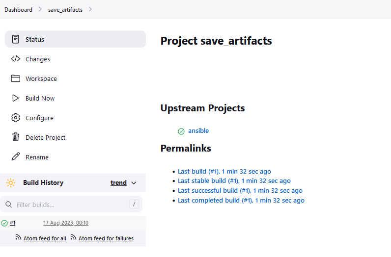

### Details of save_artifact first build in Console Output
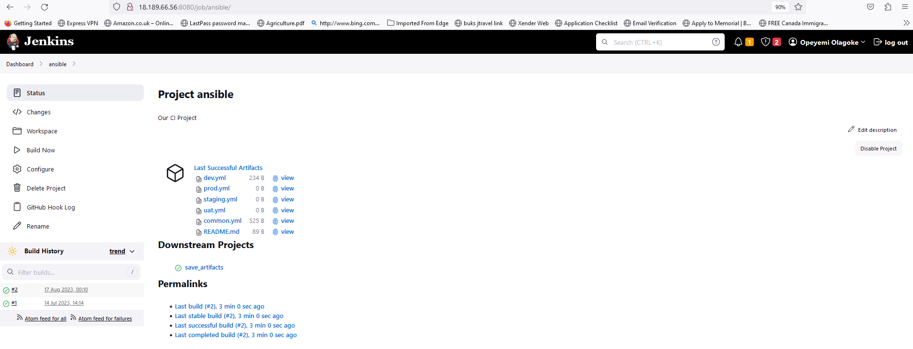

### Our Jenkins Pipeline Looking neat, and Less Complex
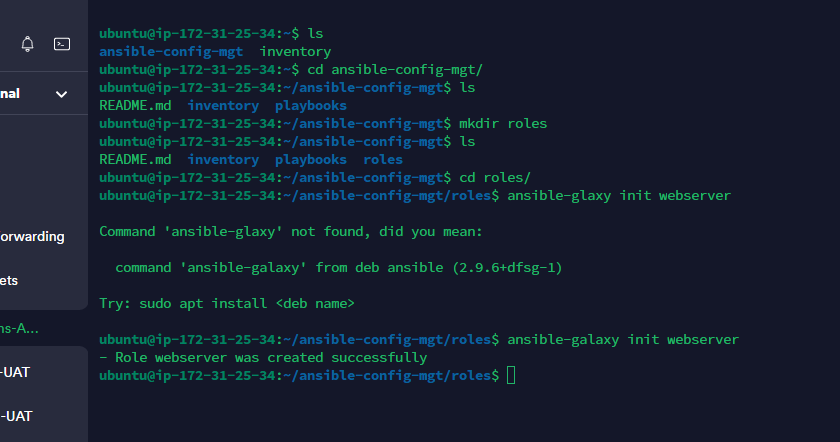

## Refactoring Ansible by Importing Playbooks for different tasks

### This is achieved by having a parent playbook named site.yml which will be used as a refference point for other playbooks (Child Playbooks)

### Running our Parent playbook site.yml against our dev environment for the removal(deleting) of wireshark, making use of the built-in ansible import-playbook Module and refferencing the child playbook static-assignment/common-del.yml

` ---`
` - hosts: all `
` - import_playbook: ../static-assignments/ ` `common-del.yml `

` ansible-playbook -i /home/ubuntu/ansible-config-artifact/inventory/dev.yml /home/ubuntu/ansible-config-artifact/playbooks/site.yml `
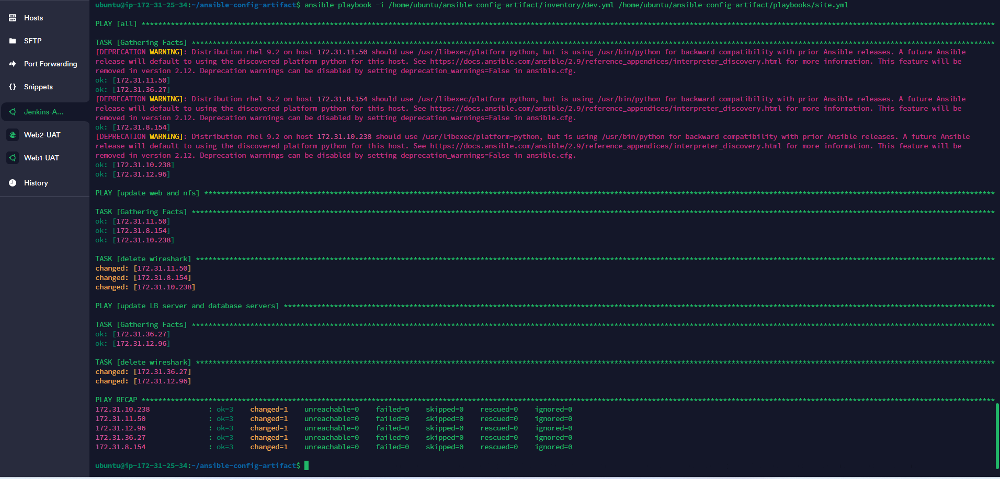

### Confirmation of removal(deleting) wireshark on all our target servers

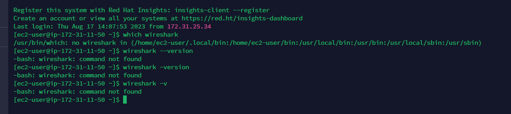

## Configuring UAT webserver with a role webserver

### Role structure of our webserver Created with Ansible Galaxy

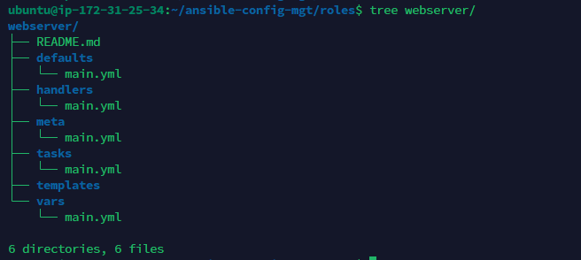

## Refferencing our webserver role inside static-assignments folder which is a container for our child playbooks

### Creating a separate assignment for our webserver role in static-assignments folder

`touch uat-webservers.yml`

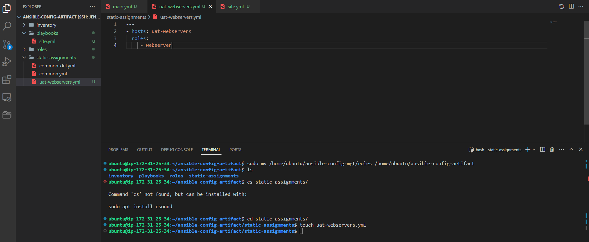

### Importing our roles playbook inside our parent playbook site.yml using the built-in ansible import playbook

`- hosts: uat-webservers `
` - import_playbook: ../static-assignments/uat-webservers.yml `

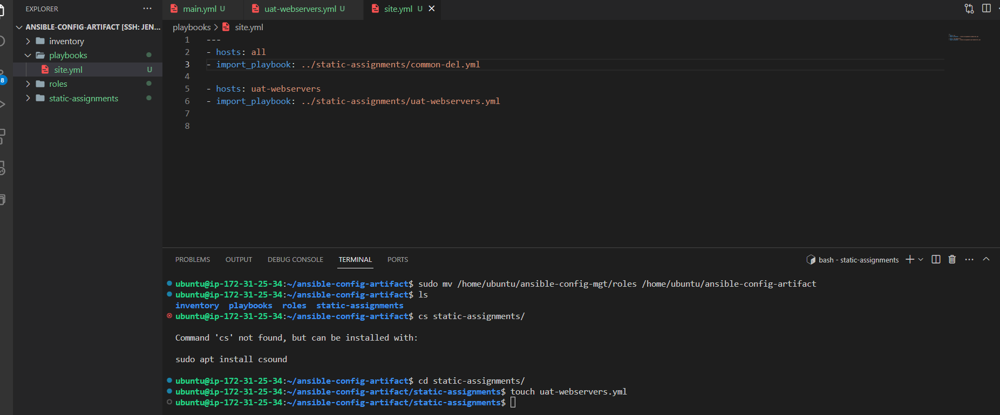

### Running our playbook against the UAT inventory for Deploying our tooling Website on the UAT servers

`ansible-playbook -i inventory/uat.yml playbooks/site`

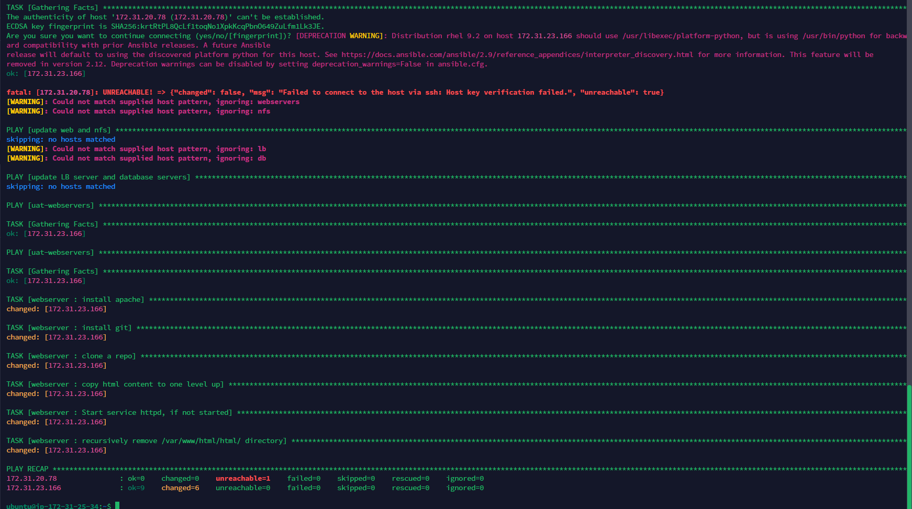

### Tooling website live on both of our UAT webservers

`http://3.15.212.16/index.php`

`http://54.211.141.19/index.php`

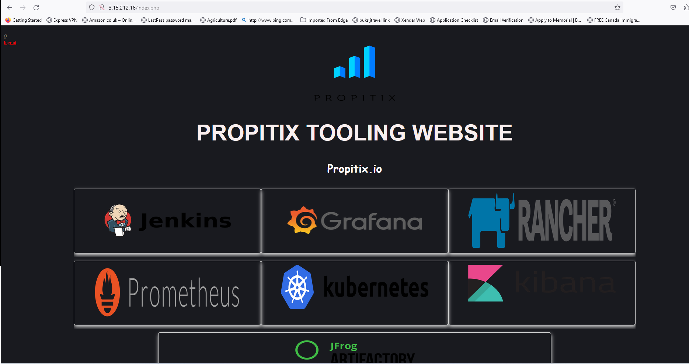
